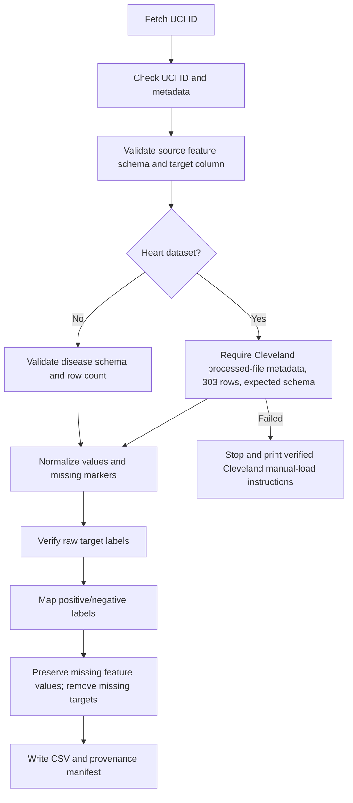
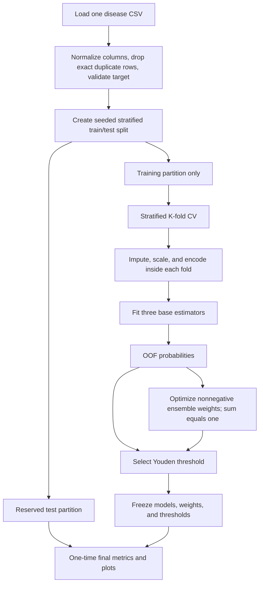
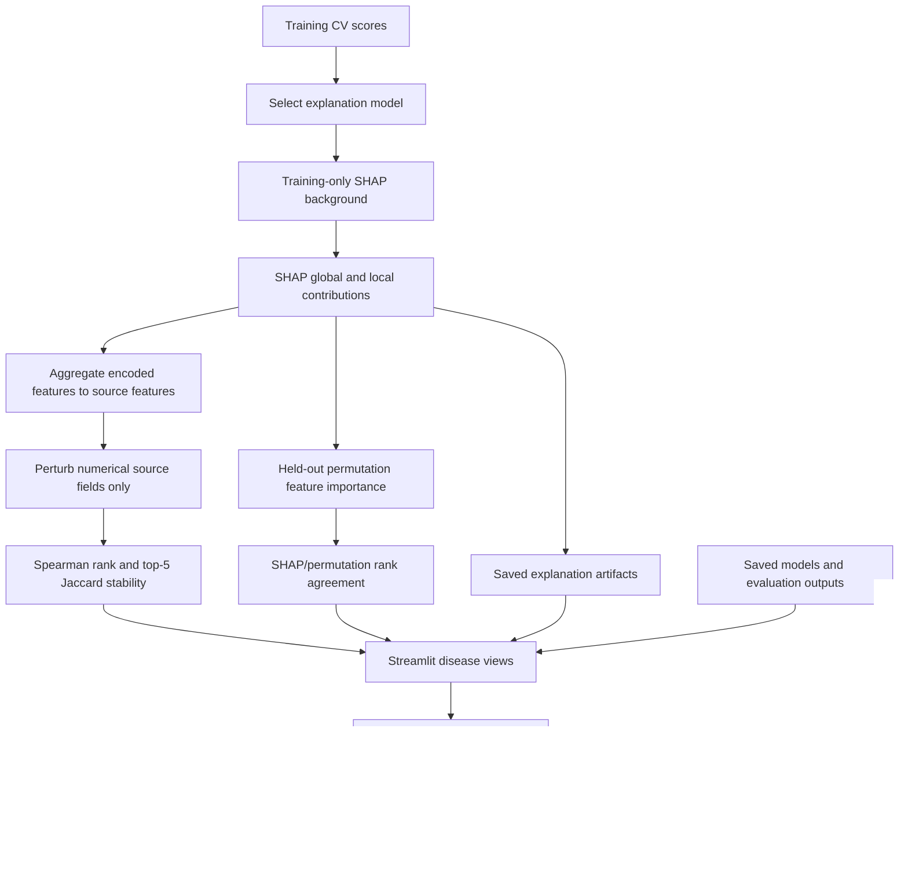

# System Architecture

## End-to-End Research Workflow

```mermaid
flowchart LR
    UCI[UCI datasets] --> D[Acquisition and provenance checks]
    D --> V[Target validation and CSV manifest]
    V --> S{Independent disease modules}
    S --> DM[Diabetes features]
    S --> HM[Cleveland heart features]
    S --> KM[CKD features]
    DM --> P[Fold-fitted preprocessing]
    HM --> P
    KM --> P
    P --> CV[Stratified training-only cross-validation]
    CV --> I[Logistic Regression / Random Forest / XGBoost]
    I --> W[OOF weighted soft voting]
    W --> E[Threshold selection from training OOF predictions]
    I --> E
    E --> T[One-time held-out evaluation]
    T --> X[CV-selected model SHAP explanations]
    X --> R[Perturbation stability and permutation agreement]
    T --> A[Streamlit research application]
    X --> A
    R --> A
```

## Dataset Acquisition and Validation

```mermaid
flowchart TD
    A[Fetch UCI ID] --> B[Check UCI ID and metadata]
    B --> C[Validate source feature schema and target column]
    C --> D{Heart dataset?}
    D -- Yes --> H[Require Cleveland processed-file metadata, 303 rows, expected schema]
    D -- No --> E[Validate disease schema and row count]
    H --> F[Normalize values and missing markers]
    E --> F
    F --> G[Verify raw target labels]
    G --> I[Map positive/negative labels]
    I --> J[Preserve missing feature values; remove missing targets]
    J --> K[Write CSV and provenance manifest]
    H -- Failed --> L[Stop and print verified Cleveland manual-load instructions]
```

## Training and Final Evaluation

```mermaid
flowchart TD
    A[Load one disease CSV] --> B[Normalize columns, drop exact duplicate rows, validate target]
    B --> C[Create seeded stratified train/test split]
    C --> D[Training partition only]
    C --> E[Reserved test partition]
    D --> F[Stratified K-fold CV]
    F --> G[Impute, scale, and encode inside each fold]
    G --> H[Fit three base estimators]
    H --> I[OOF probabilities]
    I --> J[Optimize nonnegative ensemble weights; sum equals one]
    I --> K[Select Youden threshold]
    J --> K
    K --> L[Freeze models, weights, and thresholds]
    E --> M[One-time final metrics and plots]
    L --> M
```

## Explanation, Reliability, and Application

```mermaid
flowchart TD
    A[Training CV scores] --> B[Select explanation model]
    B --> C[Training-only SHAP background]
    C --> D[SHAP global and local contributions]
    D --> E[Aggregate encoded features to source features]
    E --> F[Perturb numerical source fields only]
    F --> G[Spearman rank and top-5 Jaccard stability]
    D --> H[Held-out permutation feature importance]
    H --> I[SHAP/permutation rank agreement]
    D --> J[Saved explanation artifacts]
    G --> K[Streamlit disease views]
    I --> K
    J --> K
    M[Saved models and evaluation outputs] --> K
    K --> N[Input validation and positive-class model score]
    N --> O[On-demand local SHAP explanation]
```